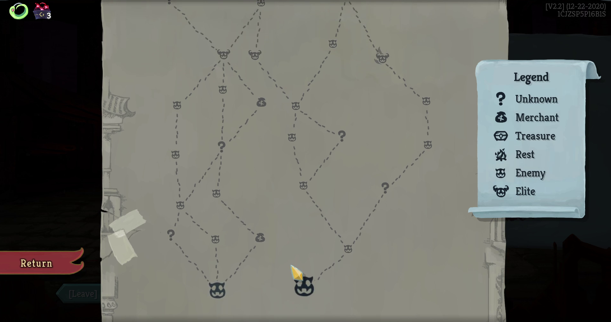

# Common Winning Paths Ascension 20 (Aggregated) | Analyzing Slay the Spire Data

For this project, I’ll share with you my analysis on Common Paths of the Slay the Spire game. I'll use the Ascension 20 winning complete runs data and aggregate total selected locations to plot the distribution of selected locations by most players. Also, this project will employ segmentation to test and have a distinct common paths for each character. The resulting charts will help most players have a general strategy on their target number of selected locations for their case. 

This project is presented in this video link

- (not available as of now)

## Slay the Spire Data Source

- https://drive.google.com/drive/folders/1HSSOyHVWr4wtKqdJUln8MNSv6nyCSxL3?usp=sharing

## Result

- **It is Clusterable and has 2 Segments**
	- More Enemies Path: More selected enemies in the map in exchange of unknowns
	- More Unknowns Path: More selected unknowns in the map in exchange of enemies
- **More Enemies Path - Aggregated Path Taken Count**
	- Unknowns: 7 -11
	- Merchants: 3-6
	- Treasures: 3
	- Rests: 7-11
	- Enemies: 12-16
	- Elites: 6-11
- **More Enemies Path - Aggregated Path Taken Count**
	- Unknowns: 11-15
	- Merchants: 3-6
	- Treasures: 3
	- Rests: 7-11
	- Enemies: 9-13
	- Elites: 6-10
- **Both Pathing Strategies is Equally Applied for Each Class**

Note: Range is between 10%-90% percentile
